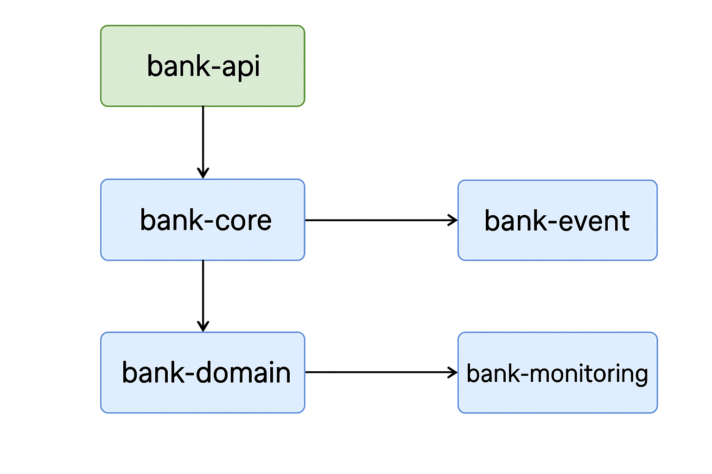

# java-bank-msa

**Multi-module Spring Boot sample (Bank MSA)**


---

## Project overview

`java-bank-msa` is a multi-module Java project (Spring Boot) that implements a simple banking microservices sample. The repository is organized into multiple modules to separate concerns such as API, core logic, domain models, events, and monitoring.

> Modules observed in the repository root:
> - `bank-api`
> - `bank-core`
> - `bank-domain`
> - `bank-event`
> - `bank-monitoring`
> - `gradle/` (wrapper)

(These module names come from the repository's top-level listing.)

---

## Goals & Intent

The project appears intended to demonstrate multi-module Spring Boot architecture for a banking-like domain, including:

- clear separation between API, domain and core business logic
- event handling / domain events
- monitoring support
- Gradle multi-module build

---

## Tech stack

- Java 17
- Spring Boot (multi-module apps usually use Spring Boot)
- Gradle wrapper (`gradlew` / `gradlew.bat` present)

(See the repository's `build.gradle` and module `build.gradle` files for exact versions and plugin configuration.)

---

## Project structure (high level)

```
java-bank-msa/
├─ bank-api/           # REST controllers, DTOs, API layer
├─ bank-core/          # core services, business logic
├─ bank-domain/        # domain model objects, entities
├─ bank-event/         # domain events, event publishers/listeners
├─ bank-monitoring/    # monitoring / observability related code
├─ gradle/             # gradle wrapper files
├─ build.gradle
├─ settings.gradle
├─ gradlew
└─ gradlew.bat
```
- Archiecture Diagram


> Note: the exact package names and class locations are found inside each module — open module folders to inspect controllers, services, repositories and event handlers.

---

## How to build

From the project root (where `gradlew` is located):

```bash
# Unix / macOS
./gradlew clean build

# Windows
gradlew.bat clean build
```

This will assemble all modules and run tests. If you prefer to build a single module, run `./gradlew :bank-api:build` (replace module name accordingly).

---

## How to run (development)

Most Spring Boot modules can be started with `bootRun` from their module directory or from the root by specifying the subproject:

```bash
# run API module
./gradlew :bank-api:bootRun
```

If the modules are designed to run independently (each a Spring Boot application), run the specific module you want to test. If the repo uses an application composition (gateway, config server, etc.), start those dependencies in order.

---

## Observations & suggestions

1. **Missing top-level README** — adding this file (which you've asked me to create) helps other developers quickly understand the project layout and how to run it.
2. **Specify Java / Spring Boot versions** — include exact versions in this README to avoid ambiguity when building locally.
3. **Add run profiles** — document environment variables, ports, and any external dependencies (databases, message brokers) required to run the app.
4. **Provide example requests** — include curl/Postman examples for the main API endpoints in `bank-api`.
5. **CI / CD** — if you use GitHub Actions or other CI tools, document how they build and deploy the project.

---

## Contributing

If you'd like to contribute:

1. Fork the repository
2. Create a feature branch
3. Add tests for new behavior
4. Open a pull request describing the change
