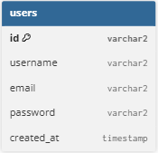
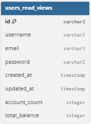
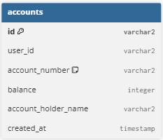
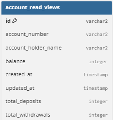
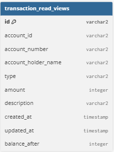

# java-bank-msa (한글 README)

Multi-module Spring Boot 예제 프로젝트 — 은행 도메인 마이크로서비스 아키텍처

---

## 요약

`java-bank-msa`는 multi-module 방식으로 구성된 Spring Boot 사이드 프로젝트입니다.

API, 핵심 비즈니스 로직, 도메인 모델, 이벤트 처리, 모니터링 등 관심사를 모듈로 분리하여

CQRS 및 이벤트 기반 흐름, Redis 기반 분산 락 사용 패턴을 보여줍니다.

---

## 목적

- 멀티 모듈(Spring/Gradle) 구조 예시
- 쓰기/읽기 분리(CQRS) + 이벤트 기반 프로세스 예시
- Redis(Redisson) 기반 분산 락 사용 예시
- 모니터링/관찰성 샘플 제공

---

## 기술 스택

- Java 17
- Spring Boot
- Gradle (wrapper 포함)
- Redis (Redisson)
- 메시지 브로커

---

## 프로젝트 구조(상위)

```
java-bank-msa/
├─ bank-api/           # REST 컨트롤러, DTO, API 레이어
├─ bank-core/          # 핵심 서비스, 비즈니스 로직
├─ bank-domain/        # 엔티티, 도메인 객체
├─ bank-event/         # 도메인 이벤트 발행/구독자
├─ bank-monitoring/    # 모니터링 관련 구성
├─ gradle/             # gradle wrapper
├─ build.gradle
├─ settings.gradle
├─ gradlew
└─ gradlew.bat
```

---

## 주요 개념

### CQRS & 이벤트 기반 흐름

- 쓰기(Write) 측에서 트랜잭션으로 상태를 변경한 뒤 도메인 이벤트(`OrderCreated`, `TransactionCreated` 등)를 발행한다.
- 이벤트는 메시지 버스에 게시되고, 읽기(Read) 측(프로젝션 혹은 소비자)이 해당 이벤트를 구독하여 조회 전용 모델을 갱신한다.
- 이로 인해 읽기와 쓰기를 독립적으로 확장 가능하고, 읽기 최적화 테이블(혹은 캐시)을 자유롭게 설계할 수 있다.

### ERD

CQRS 패턴을 도입하여 Query 테이블과 Command 테이블을 분리하였습니다.

|                  | Command 테이블           | Query 테이블             |
|------------------|-----------------------|-----------------------|
| User (사용자)       |  |  |
| Account (계좌)     |  |  |
| Transaction (거래) |  |  |

> 주: 실제 코드의 엔티티 필드명은 `bank-domain` 모듈의 소스 코드를 참조하세요. 위 ERD는 이해를 돕기 위한 표준화된 예시입니다.

### 계좌 이체 API 호출 예시
- 요청 예시
```http request
POST http://localhost:8080/api/accounts/transfer
Content-Type: application/json

{
  "fromAccountNumber": "123-456-7890",
  "toAccountNumber": "987-654-3210",
  "amount": 50000,
  "description": "점심값 이체"
}

```
- 응답 예시
```json
{
  "transactionId": "a2f4b1d2-84f7-4b90-b234-1cfde4e92b1a",
  "fromAccountNumber": "123-456-7890",
  "toAccountNumber": "987-654-3210",
  "amount": 50000,
  "description": "점심값 이체",
  "status": "SUCCESS",
  "createdAt": "2025-10-19T12:45:20.732",
}

```

### 분산 락 (Redisson `RLock`)

- 동시성 문제(예: 동일 계좌의 중복 출금, 중복 거래 요청)를 방지하기 위해 **Redis 기반 분산 락**을 적용했습니다.
- Redisson의 `RLock`을 사용하여 트랜잭션 단위로 락을 제어하고, 일정 시간이 지나면 자동 해제되도록 `leaseTime`을 설정합니다.
- 일반적 사용 패턴:
  ```java
  RLock lock = redissonClient.getLock("account:" + accountId);
  if (lock.tryLock(500, 3000, TimeUnit.MILLISECONDS)) {
      try {
          // 비즈니스 로직 실행
      } finally {
          if (lock.isHeldByCurrentThread()) {
              lock.unlock();
          }
      }
  }
  ```

### 예외 처리 및 트랜잭션 보상(Compensation)

- 단일 트랜잭션(@Transactional) 범위를 넘어서는 분산 트랜잭션의 경우, 보상 트랜잭션(Compensating Transaction) 전략을 사용합니다.
- 예를 들어, 거래 실패 시 반대 방향의 취소 이벤트를 발행하여 상태를 복구합니다.


---

## 빌드

루트에서 전체 빌드:

```bash
# Unix / macOS
./gradlew clean build

# Windows
gradlew.bat clean build
```

특정 모듈만 빌드:

```bash
./gradlew :bank-api:build
```

---

## 실행(개발용)

각 모듈에서 `bootRun`을 사용하거나 루트에서 서브프로젝트를 지정하여 실행합니다.

```bash
# API 모듈 실행 예시
./gradlew :bank-api:bootRun
```

모듈들이 독립적 Spring Boot 앱이라면 의존 서비스(예: Redis, DB, Kafka 등)를 먼저 띄워주세요.

---


## 운영/구현 노트

- 모듈화된 구조로 인해 특정 기능(예: 이벤트 발행/구독, 모니터링)을 독립적으로 확장/교체 가능합니다.
- 테스트와 로컬 개발을 위해 Docker Compose로 DB, Redis 등을 띄우면 편리합니다.
- 분산락은 성능과 장애 시 복구 전략(leaseTime, 재시도 정책)을 신중히 설계해야 합니다.


